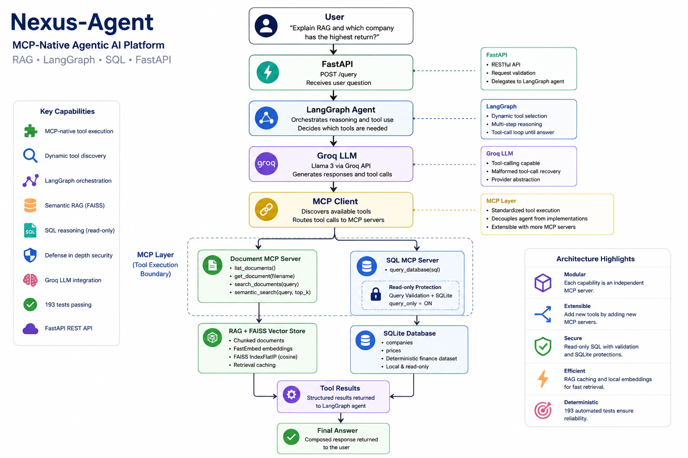

# Nexus-Agent

### MCP-Native Agentic AI Platform with RAG, LangGraph, SQL Reasoning, and FastAPI

Nexus-Agent is a modular agentic AI system that combines **Model Context Protocol (MCP)**, **LangGraph**, **semantic RAG**, **FAISS**, **SQL reasoning**, and **FastAPI** behind a unified tool-execution architecture.

Instead of hard-coding application logic for every question, the agent dynamically discovers available MCP tools and decides which capabilities are required to answer a user's request.

It can retrieve information from documents, perform structured queries against a finance database, or use multiple tools in a single reasoning workflow.

---

## Key Capabilities

- **MCP-native tool execution**
- **Dynamic tool discovery** through MCP
- **LangGraph agent orchestration**
- **Semantic RAG using FAISS**
- **Local embeddings with FastEmbed**
- **SQL MCP server with read-only protection**
- **Multi-MCP tool selection**
- **Groq LLM integration**
- **Recovery from malformed Groq/Llama tool calls**
- **FastAPI REST API**
- **Deterministic offline test suite**
- **193 automated tests passing**

---

# Architecture

```text
                         User
                           │
                           ▼
                    ┌─────────────┐
                    │   FastAPI   │
                    │   /query    │
                    └──────┬──────┘
                           │
                           ▼
                    ┌─────────────┐
                    │  LangGraph  │
                    │    Agent    │
                    └──────┬──────┘
                           │
                           ▼
                    ┌─────────────┐
                    │  Groq LLM   │
                    └──────┬──────┘
                           │
                  Dynamic MCP Tool Selection
                           │
              ┌────────────┴────────────┐
              │                         │
              ▼                         ▼
       ┌──────────────┐         ┌──────────────┐
       │ Document MCP │         │    SQL MCP   │
       └──────┬───────┘         └──────┬───────┘
              │                        │
              ▼                        ▼
       ┌──────────────┐         ┌──────────────┐
       │ RAG / FAISS  │         │   SQLite     │
       └──────┬───────┘         └──────┬───────┘
              │                        │
              └────────────┬───────────┘
                           │
                           ▼
                     Tool Results
                           │
                           ▼
                      LangGraph
                           │
                           ▼
                       Groq LLM
                           │
                           ▼
                      Final Answer
```

### MCP Execution Boundary

The agent is intentionally decoupled from the underlying RAG and database implementations.

```text
LangGraph Agent
       │
       ▼
   MCP Client
       │
       ▼
  MCP Server
       │
       ▼
Domain implementation
```

The agent decides **which tool to use**, while the MCP layer handles **tool execution**.

---

# RAG & Document Intelligence

Nexus-Agent provides both lexical and semantic document retrieval.

### Document MCP Tools

```text
list_documents()
get_document(filename)
search_documents(query)
semantic_search(query, top_k)
```

### Semantic RAG Pipeline

```text
Documents
    │
    ▼
Ingestion
    │
    ▼
Chunking
    │
    ▼
Embeddings
    │
    ▼
FAISS Index
    │
    ▼
Semantic Search
    │
    ▼
Relevant Context
    │
    ▼
LLM
    │
    ▼
Grounded Answer
```

The default embedding configuration uses:

- `BAAI/bge-small-en-v1.5`
- 384-dimensional embeddings
- FastEmbed / ONNX Runtime
- FAISS `IndexFlatIP`
- normalized vectors, making inner product equivalent to cosine similarity

A deterministic hashing embedding provider is also available for fully offline testing.

### Retrieval Caching

The RAG pipeline generates a SHA-256 fingerprint from:

- document contents
- chunking configuration
- embedding configuration

The existing FAISS index is reused when the fingerprint is unchanged, avoiding unnecessary re-embedding.

---

# LangGraph Agent Orchestration

LangGraph manages the agent's reasoning loop.

```text
START
  │
  ▼
Agent Node
  │
  ├── Final answer ───────────► END
  │
  └── Tool call
          │
          ▼
      Tools Node
          │
          ▼
       MCP Client
          │
          ▼
      Tool Result
          │
          └──────────────► Agent Node
```

The graph supports:

- dynamic tool selection
- sequential tool calls
- multiple tool calls
- tool validation
- MCP failure handling
- LLM failure handling
- maximum reasoning rounds
- graceful final responses

---

# Multi-MCP Architecture

Nexus-Agent exposes multiple independent MCP servers.

## Document MCP

Provides:

- document listing
- document retrieval
- lexical search
- semantic RAG search

## SQL MCP

Provides:

```text
query_database(sql)
```

The LangGraph agent dynamically selects the appropriate MCP tool based on the user's question.

It can also use **both MCP servers within the same workflow**.

For example:

> Explain RAG using the documents and tell me which company has the highest return.

The workflow can become:

```text
Document MCP → RAG information
       │
       ├──────────────┐
       │              │
SQL MCP → Financial calculation
       │              │
       └───────┬──────┘
               ▼
        Combined Answer
```

---

# SQL Safety

The SQL MCP server is intentionally read-only.

Every query passes through two independent layers of protection.

## Layer 1 — Query Validation

`query_guard.py` rejects:

- `INSERT`
- `UPDATE`
- `DELETE`
- `REPLACE`
- `DROP`
- `ALTER`
- `CREATE`
- `TRUNCATE`
- `ATTACH`
- `DETACH`
- `PRAGMA`
- `VACUUM`
- transaction-control statements
- multiple SQL statements
- malformed/non-SELECT queries

Forbidden keywords are checked against the raw SQL before comment stripping, preventing prohibited operations from being hidden inside SQL comments.

## Layer 2 — SQLite Read-Only Configuration

The database connection is configured with SQLite read-only protections and `PRAGMA query_only = ON`.

This provides defense in depth rather than relying solely on LLM behavior.

---

# Finance Database

The project includes a deterministic local finance database.

### Tables

```text
companies
├── company_id
├── ticker
├── name
└── sector

prices
├── price_id
├── ticker
├── trade_date
├── close_price
└── volume
```

The database is generated deterministically and is intentionally excluded from Git.

For the demo dataset, stock return is calculated as:

```text
((latest_close - earliest_close) / earliest_close) × 100
```

Using this definition, **TSLA has the highest return at 18.0%**.

---

# Groq LLM Integration

Nexus-Agent uses Groq as its LLM provider.

The LLM provider is abstracted so the agent does not depend directly on a specific API implementation.

The provider also handles malformed tool-call formats occasionally produced by Llama/Groq, including Pythonic function-call syntax such as:

```text
<function=tool_name={...}>
```

The recovery mechanism is implemented generically rather than being tied to a specific MCP tool.

---

# FastAPI

Nexus-Agent exposes the agent through:

```text
POST /query
```

### Request

```json
{
  "question": "What does RAG mean according to the documents?"
}
```

### Response

```json
{
  "answer": "...",
  "metadata": {
    "question": "What does RAG mean according to the documents?"
  }
}
```

The API delegates to the LangGraph agent rather than duplicating the agent logic.

---

# Demo

Nexus-Agent can combine information from multiple MCP tools in a single request.

## Document RAG

```text
What does RAG mean according to the documents?
```

Example result:

```text
RAG stands for Retrieval-Augmented Generation.
It combines retrieval from an external knowledge base
with generation from a language model.
```

## SQL Reasoning

```text
Which company has the highest return?
```

Example result:

```text
TSLA — Tesla, Inc. — 18.0%
```

## Multi-MCP Query

```text
Explain RAG using the documents, and also tell me
which company has the highest return and its return percentage.
```

This can require both:

```text
Document MCP → RAG information
SQL MCP      → Financial calculation
       │
       ▼
Combined final answer
```

---

# Example API Request

Start the API:

```bash
python -m uvicorn nexusai.api.app:app --reload
```

Then:

```bash
curl -X POST http://127.0.0.1:8000/query \
  -H "Content-Type: application/json" \
  -d "{\"question\":\"Explain RAG using the documents, and also tell me which company has the highest return and its return percentage.\"}"
```

Example response:

```json
{
  "answer": "RAG, or Retrieval-Augmented Generation, is ... The company with the highest return is TSLA with a return percentage of 18.0.",
  "metadata": {
    "question": "Explain RAG using the documents, and also tell me which company has the highest return and its return percentage."
  }
}
```

---

# Project Structure

```text
Nexus-Agent/
│
├── data/
│   ├── documents/
│   │   ├── langgraph_notes.txt
│   │   ├── mcp_overview.txt
│   │   └── rag_basics.txt
│   │
│   └── eval/
│       └── rag_eval_dataset.json
│
├── src/
│   └── nexusai/
│       ├── agent/
│       │   ├── langgraph_agent.py
│       │   └── tool_agent.py
│       │
│       ├── api/
│       │   └── app.py
│       │
│       ├── client/
│       │   └── mcp_client.py
│       │
│       ├── db/
│       │   ├── query_guard.py
│       │   └── sql_database.py
│       │
│       ├── llm/
│       │   └── provider.py
│       │
│       ├── mcp_servers/
│       │   ├── document_server.py
│       │   └── sql_server.py
│       │
│       └── rag/
│           ├── chunking.py
│           ├── config.py
│           ├── embeddings.py
│           ├── evaluation.py
│           ├── ingestion.py
│           ├── pipeline.py
│           └── vector_store.py
│
├── tests/
├── .env.example
├── .gitignore
├── requirements.txt
└── README.md
```

---

# Installation

## Requirements

- Python 3.11+
- Groq API key for live agent execution

Create and activate a virtual environment:

### Windows

```cmd
python -m venv .venv
.venv\Scripts\activate
```

### Linux / macOS

```bash
python -m venv .venv
source .venv/bin/activate
```

Install dependencies:

```bash
pip install -r requirements.txt
```

Create the environment file:

### Windows

```cmd
copy .env.example .env
```

### Linux / macOS

```bash
cp .env.example .env
```

Add your Groq API key:

```text
GROQ_API_KEY=your_key_here
```

**Never commit `.env` to Git.**

---

# Running the Agent

Set the source path.

### Windows

```cmd
set PYTHONPATH=src
```

### Linux / macOS

```bash
export PYTHONPATH=src
```

Run the LangGraph agent:

```bash
python -m nexusai.agent.langgraph_agent
```

---

# Running the API

Start FastAPI:

```bash
python -m uvicorn nexusai.api.app:app --reload
```

The API will be available at:

```text
http://127.0.0.1:8000
```

---

# Testing

The complete automated test suite currently passes:

```text
193 passed
```

Run:

```bash
PYTHONPATH=src pytest tests/ -v
```

The test suite covers:

- MCP client and server behavior
- Dynamic tool discovery
- LangGraph orchestration
- Multi-MCP workflows
- RAG ingestion and retrieval
- Chunking
- Embeddings
- FAISS vector search
- RAG caching
- RAG evaluation
- SQL database operations
- Read-only SQL validation
- Groq provider behavior
- Malformed tool-call recovery
- FastAPI endpoints

The tests use deterministic and mocked components where appropriate, allowing the majority of the suite to run without a live Groq API call.

---

# Security

Secrets and generated artifacts are excluded from Git:

```text
.env
nexs/
data/index/
data/nexus.db
.pytest_cache/
__pycache__/
```

The repository contains only `.env.example` for configuration reference.

The SQL layer additionally applies read-only validation before database execution.

---

# Design Principles

## MCP as the Execution Boundary

The agent decides **which tool to use**, while MCP controls **how the tool is executed**.

```text
Agent
  │
  ▼
MCP Client
  │
  ▼
MCP Server
  │
  ▼
Domain Implementation
```

## Separation of Concerns

RAG, database access, LLM interaction, MCP transport, agent orchestration, and API serving are separated into independent modules.

## Deterministic Testing

Core functionality can be tested without relying on live network services or paid APIs.

## Defense in Depth

The SQL layer combines query validation with database-level read-only controls.

## Provider Abstraction

The agent communicates through an LLM provider abstraction rather than being tightly coupled to a single API implementation.

---

# Limitations

The current project intentionally keeps its scope focused.

Current limitations include:

- No persistent conversational memory
- Single-agent LangGraph architecture
- SQLite rather than a production database
- FAISS `IndexFlatIP` is intended for the current small corpus
- No authentication layer for the FastAPI endpoint
- No production deployment configuration
- No distributed MCP infrastructure

These are deliberate scope boundaries for the current implementation.

---

# License

This project is intended as a portfolio and learning project.